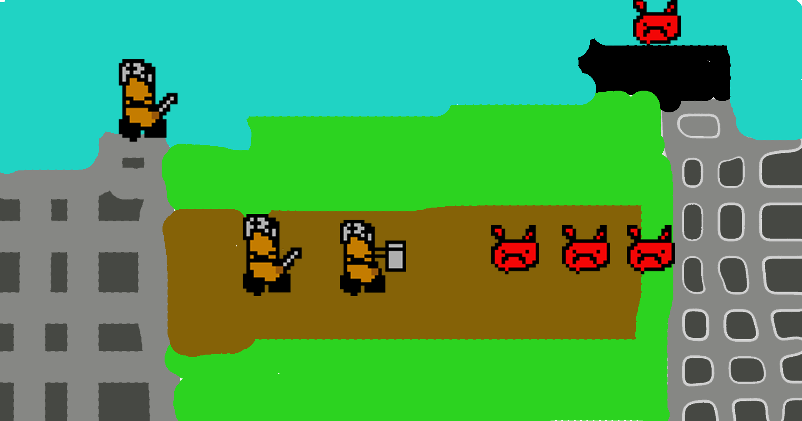
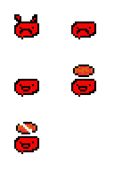
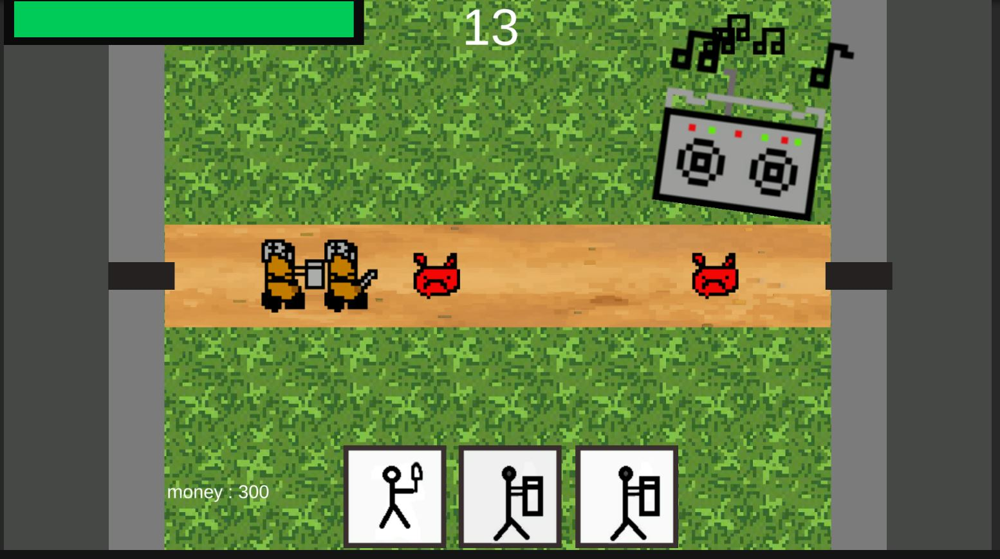
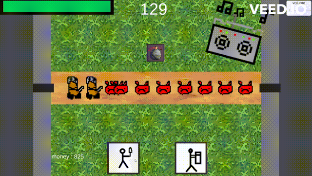
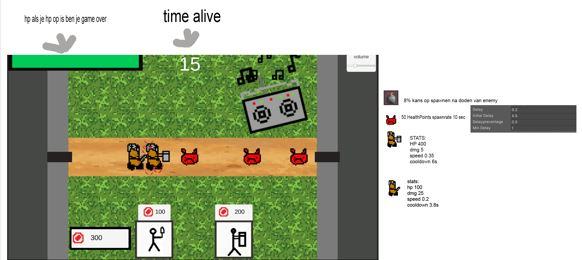
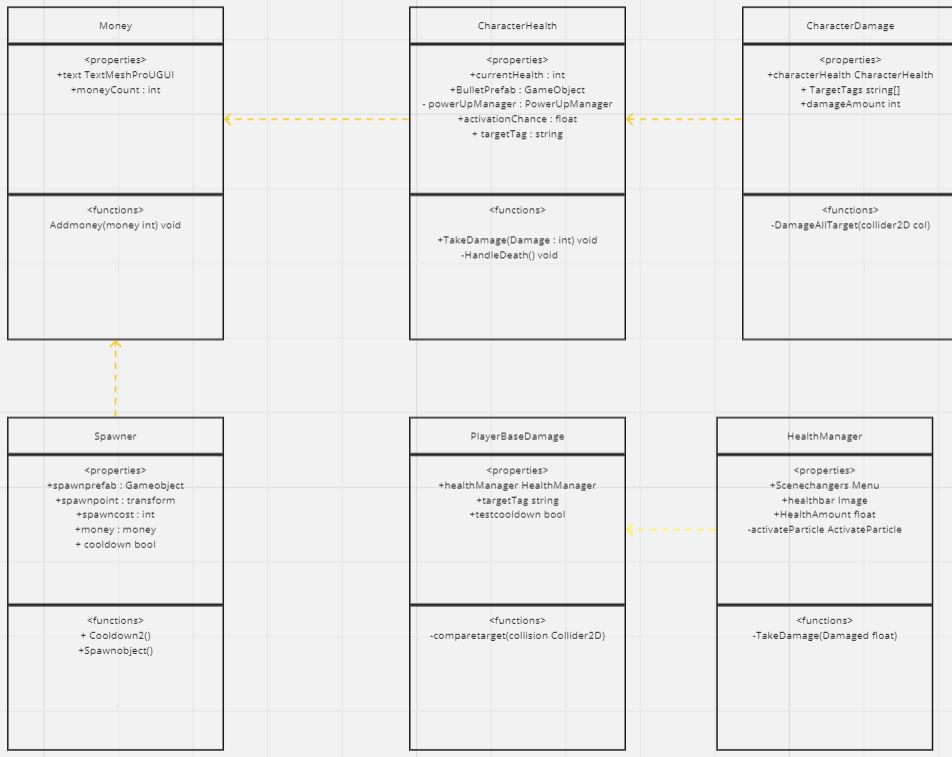
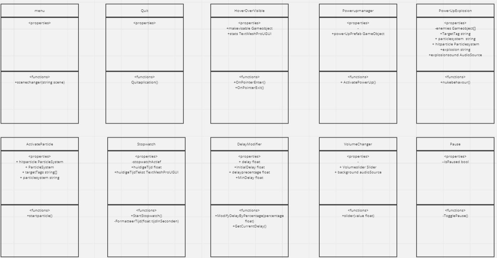

# TowerDefenseTemplate
Mijn tower defense-game is een eenvoudige top-down strategiegame waarin spelers geld gebruiken om troepen in te huren en verschillende torens te bouwen om eindeloze golven van vijanden te stoppen voordat ze de kern van hun basis kunnen bereiken. Spelers moeten hun middelen verstandig beheren en strategisch nadenken om te overleven in dit spannende spel. De game biedt zowel uitdaging als plezier voor alle soorten spelers.

    
    

## Product 1: "DRY SRP Scripts op GitHub"

In dit script heb ik een array genaamd targetTags gebruikt om de tags van de objecten te specificeren waartegen ik knockback wil toepassen. Deze aanpak minimaliseert herhaling van code (DRY-principe) omdat ik met een enkele for-each loop door alle doelobjecten kan gaan en knockback kan toepassen. Hierdoor hoef ik niet dezelfde code te herhalen voor elk type vijand, wat de code efficienter en onderhoudbaar maakt.
[link naar script](/towerdefense/Assets/scripts/enemy/Knockback.cs)"*

voor srp heb ik een menu script
een simpele script die een functie heeft die de scene veranderd ik zoe deze script op verschillende manieren kunnen gebruiken voor pauze of als je dood zou gaan dat het level weer opnieuw gestart word.
[link naar script](/towerdefense/Assets/scripts/UI/menu/menu.cs)"*

## Product 2: "Projectmappen op GitHub"
Dit is de [ROOT](/towerdefense/) folder van mijn unity project.

Zorg dat deze verwijst naar je Develop branch.

## Product 3: Build op Github

[Release Voorbeeld](https://github.com/Jamydewaalmedia/TowerDefenseTemplate/releases)

## Product 4: Game met Sprites(animations) en Textures 

## Product 5: Issues met debug screenshots op GitHub 
[Hier de link naar mijn issues](https://github.com/Jamydewaalmedia/TowerDefenseTemplate/issues/)

## Product 6: Game design met onderbouwing 

*  **Je game bevat torens die kunnen mikken en schieten op een bewegend doel.** 

*mijn torens zijn units die enemies aan vallen wanneer ze in een collide met elkaar ze worden ingespawned met een knop*

*  **Je game bevat vernietigbare vijanden die 1 of meerderen paden kunnen volgen.**  

*ik heb 1 enemie die een to target script heeft waardoor hij loopt naar een aangegeven target*

*  **Je game bevat een “wave” systeem waarmee er onder bepaalde voorwaarden (tijd/vijanden op) nieuwe waves met vijanden het veld in komen.**

*mijn enemies worden gespawned met een interval van 10 seconds maar er zit een delaydevider die de 10 seconde steeds kleiner maakt door tedelen door een megeven getal*

*  **Een “health” systeem waarmee je levens kunt verliezen als vijanden hun doel bereiken en zodoende het spel kunt verliezen.** 

*ik heb een healthbar die damage krijgt als een enemie met mijn base/tower collide heb dit gedaan door een fill van een image aantepassen naar de amount van damage*

*  **Een “resource” systeem waarmee je resources kunt verdienen waarmee je torens kunt kopen en .evt upgraden.**

*ik heb een money system waarmee ik geld krijg als ik een enemie versla en verlies als ik units koop(inhuur)*

*  **een power up systeem**

*ik heb een powerup manager die kijkt of een enmie word verslagen en dan heb je een 0.08% kans dat een power up spawned *

## Product 7: Class Diagram voor volledige codebase 

 []
 []
 

## Product 8: Prototype test video 

## Product 9: SCRUM planning inschatting 

[Link naar de openbare trello](https://trello.com/b/2ZdgNw5C/towerdefense)

## Product 10: Gitflow conventions

ik heb vaak feature branches gemaakt maar nooit gepushed.
ik ging eigenlijk full time aan een feature werken en niet switchen dus maakte ik de feature gelijk af en finishde hem waardoor hij naar develop werd gemerged.heb het zovaak mogelijk gebruikt.

